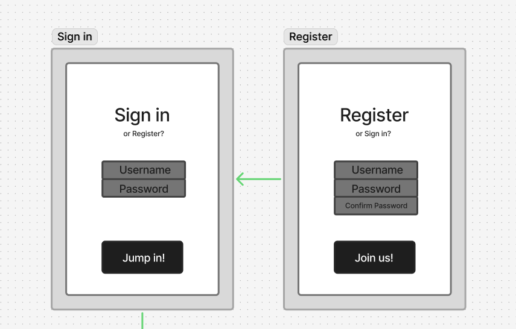
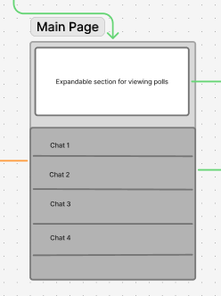
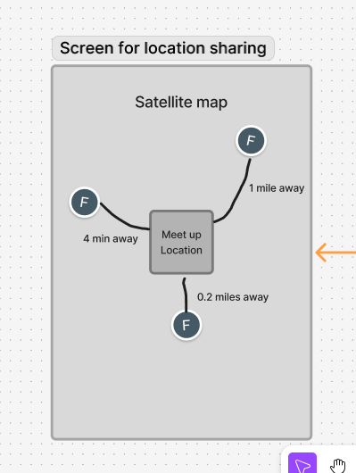
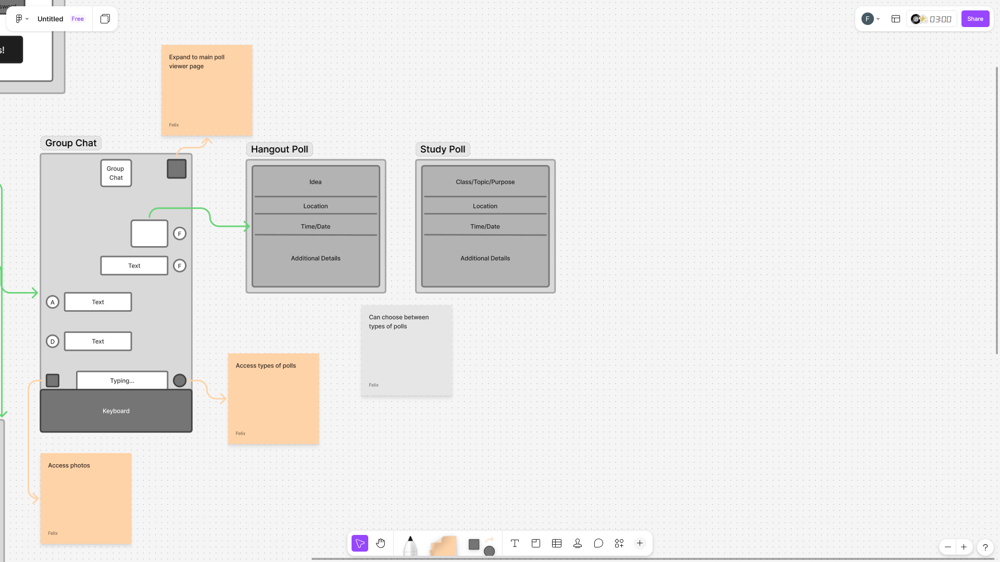
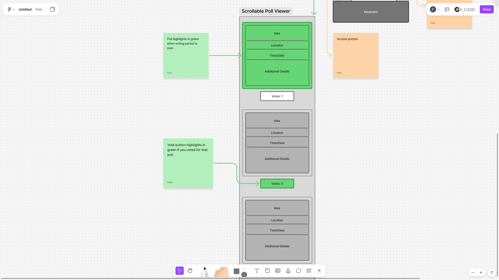
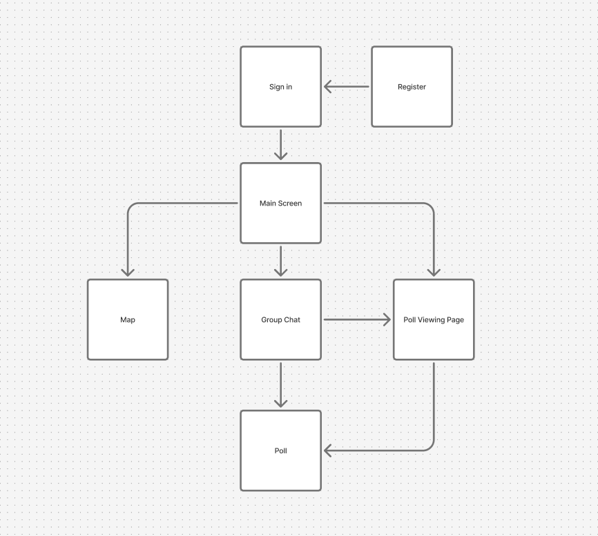

The content below is an example project proposal / requirements document. Replace the text below the lines marked "**TODO**" with details specific to your project. Remove the "TODO" lines.

(**\_TODO**: your project name\_)

# Shoppy Shoperson

## Overview

(**\_TODO**: a brief one or two paragraph, high-level description of your project\_)

Growing up, it was easier to hang out with friends, once everyone finished homework or sports, you could quickly follow through with plans. Now that everyone's grown up, it's harder to schedule hang outs due to obligations or other blocking factors.

appname is a solution to that problem: it will allow everyone in a group chat to post polls that clearly state the details of a hang out such as idea, time, location. The current time we live in is quite fast paced, and any friction when planning could likely lead to abandoned plans. By streamlining the hang out experience as much as possible, appname hopes to promote more fun times with friends.

## Data Model

(**\_TODO**: a description of your application's data and their relationships to each other\_)

The application will store Users, Polls and User Locations

- users can have multiple polls (references)
- each poll can have multiple details and options (embedding)
- user locations can be tracked for everyone in a hangout to see

(**\_TODO**: sample documents\_)

An Example User:

```javascript
{
  username: "the_mainPlanner",
  hash: // password hash
  polls: // array of references to poll documents
  currentLocation: // location object { lat, long }
}
```

An Example Poll with Embedded details:

```javascript
{
  creator: // reference to a User object
  eventDetails: {
    title: "Group picnic at Central Park",
    location: "1802 65th Street Transverse, 1802 E 65th St, New York, NY 10065"
    time: "3/29/26 @12pm" // some kind of Time/Date object to handle this
  }
  votes: // number of interested users
  voters: // who is intere  sted, user references
  createdAt: // timestamp
}
```

## [Link to Commented First Draft Schema](db.js)

(**\_TODO**: create a first draft of your Schemas in db.js and link to it\_)

## Wireframes

(**\_TODO**: wireframes for all of the pages on your site; they can be as simple as photos of drawings or you can use a tool like Balsamiq, Omnigraffle, etc.\_)

Link to Figma wireframe: https://www.figma.com/board/wN67poP2ezvqhQkjSDcOYV/Untitled?node-id=0-1&t=Ow88ODcwuaYI81mR-1

Pages for login/register



Main Page



Page for seeing where everyone is



Pages for chatting in a group and posting kinds of polls



Page for viewing polls and voting results



## Site map

(**\_TODO**: draw out a site map that shows how pages are related to each other\_)



## User Stories or Use Cases

(**\_TODO**: write out how your application will be used through [user stories](http://en.wikipedia.org/wiki/User_story#Format) and / or [use cases](https://www.mongodb.com/download-center?jmp=docs&_ga=1.47552679.1838903181.1489282706#previous)\_)

1. as non-registered user, I can register a new account with the site
2. as a user, I can log in to the site
3. as a user, I can make a group chat(s) and message in it(them)
4. as a user, I can post polls to the group chat
5. as a user, I can post photos to the group chat
6. as a user, I can view and vote on all of the existing polls
7. as a user, I can submit alternate proposals
8. as a user, I can see where my friends are in relation to the destination
9. as a user, I can edit my polls
10. as a user, I clearly see which poll I voted on and which poll is decided on

## Research Topics

(**\_TODO**: the research topics that you're planning on working on along with their point values... and the total points of research topics listed\_)

- (5 points) Map Integration using Leaflet.js and Geolocation API
  - I will use the Leaflet.js library to display an interactive map for everyone to see each others locations.
  - The app will use the browser's Geolocation API to ask users for their current coordinates.
  - This allows users to see where the event is and where their friends are in relation to the meeting point.
- (4 points) Allow for instant messaging and real time updates with Socket.io
  - Want fast communication and updates so people can efficiently make and follow through with plans.
- (4 points) User Authentication with Passport.js
  - Passport.js for user authentication.
  - This is so the app knows who is sharing their location and prevents unknown users from voting.

10 points total out of 8 required points (**\_TODO**: addtional points will **not** count for extra credit\_)

## [Link to Initial Main Project File](app.js)

(**\_TODO**: create a skeleton Express application with a package.json, app.js, views folder, etc. ... and link to your initial app.js\_)

## Annotations / References Used

(**\_TODO**: list any tutorials/references/etc. that you've based your code off of\_)

1. [passport.js authentication docs](http://passportjs.org/docs) - (add link to source code that was based on this)
2. [tutorial on vue.js](https://vuejs.org/v2/guide/) - (add link to source code that was based on this)
